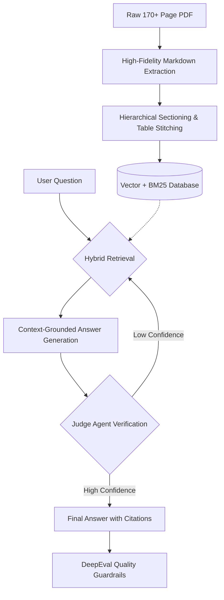

<div align="center">

# EPA Pesticide Regulatory Consultant

A RAG system for querying unstructured EPA pesticide regulatory PDFs.

</div>

---

## Introduction

A RAG pipeline for converting unstructured EPA regulatory PDFs into structured, queryable data. It utilizes hybrid search (Vector + BM25), an autonomous "Judge" agent for query refinement, and evidence-based verification to ensure high-accuracy answers with cited sources.

https://github.com/user-attachments/assets/aeca454a-2977-47ca-9b70-2df93f4ae5aa

## Tech Stack

- **Backend**: Python, FastAPI, LangChain, ChromaDB, LLMs (OpenAI/Gemini/OpenRouter), DeepEval, DataLab/PyMuPDF4LLM, Pydantic, Pytest, uv
- **Frontend**: TypeScript, React, Vite, Tailwind CSS, Playwright

## Usage

### Prerequisites

- Python 3.10+
- Node.js 18+
- [uv](https://github.com/astral-sh/uv) (for backend dependency management)

### Setup & Run

**Backend**

```bash
cd backend

# Install dependencies and create virtualenv
uv sync

# Setup environment variables
cp .env.example .env

# Data Preparation (Required for first run)
# 1. Place your PDFs in backend/data/raw/
# 2. Run the ingestion pipeline (Extract -> Parse -> Chunk)
uv run python scripts/pipeline/run_pipeline.py

# 3. Extract Tables (Required for Table Explorer)
uv run python scripts/pipeline/extract_tables.py

# 4. Seed the Vector Database
uv run python scripts/setup/seed_db.py

# Run API server
uv run uvicorn main:app --reload
# API available at http://localhost:8000
```

**Frontend**

```bash
cd frontend

# Install dependencies
npm install

# Run development server
npm run dev
# App available at http://localhost:5173
```

> **Note**: For detailed data processing and ML scripts, see `backend/data_processing/README.md` and `backend/ml/README.md`.

## How It Works

The system is designed to handle the complexity of **regulatory compliance** where precision is more important than "creativity."

We treat the PDF as a structured database rather than just a wall of text.



### 1. The Knowledge Engine (Data Engineering)

- **The Challenge**: EPA documents use inconsistent numbering (e.g., _Part 1.2.1_ vs _Section II_) and tables often split across pages, losing their headers.
- **The Solution**: We implemented a **"Stitch & Refine"** pipeline.
  - **Hierarchical Parsing**: We reconstruct the document tree to understand the relationship between headers and sub-headers.
  - **Table Refinement**: A specialized `extract_tables.py` script identifies fragmented tables across page breaks and "re-stitches" them into single, queryable JSON objects.
  - **Template Filtering**: Automatically identifies and filters out empty template forms (common in Appendices) to reduce "noise" in search results.

### 2. Hybrid Intent Matching (Retrieval)

- **The Challenge**: Standard AI search (Vectors) is great for "vibes" but terrible at specific regulatory codes (e.g., "WAG87####E").
- **The Solution**: We utilize **Hybrid Search** with **Reciprocal Rank Fusion (RRF)**.
  - **Vector Search**: Performs semantic retrieval to find conceptually related sections (e.g., "How to report an accident").
  - **BM25 (Keyword Search)**: Performs exact-match retrieval for precise regulatory codes, chemical names, or acronyms.
  - **Fusion (RRF)**: Mathematically combines both result sets to ensure the most relevant chunks rise to the top, regardless of whether they were found by "meaning" or "keywords."
  - **Result**: Data is captured from both high-level legal intent and granular technical specifics.

### 3. The Verifiable Answer (ML & Quality)

- **The Challenge**: LLMs can "hallucinate" plausible but legally incorrect dates or deadlines.
- **The Solution**:
  - **Self-Correction Loop**: If our internal **Judge Agent** determines that the retrieved info doesn't fully answer the question, it autonomously rewrites the search query and tries again.
  - **Evidence Grounding**: Each answer is accompanied by a **Clickable Citation**. The UI maps these directly to the PDF page and highlights the text to provide a "Chain of Custody" for information.
  - **DeepEval Guardrails**: We use **Golden Datasets** and LLM-assisted metrics to enforce rigorous quality standards:
    - **Faithfulness (Fact-Checking)**: Ensures the answer is strictly based on the retrieved text and doesn't invent new information.
    - **Answer Relevancy**: Ensures the answer directly addresses the user's specific question without including irrelevant fluff.

### 4. User Interface (Full-Stack)

- **Q&A**: Interactive chat interface for querying documents.
- **Citations**: Answers include citations linking back to specific source chunks.
- **Tables**: Dedicated view for extracted regulatory tables.

## Team

- Justin Jonany
- Ricky Tang
- Richard Zhu
