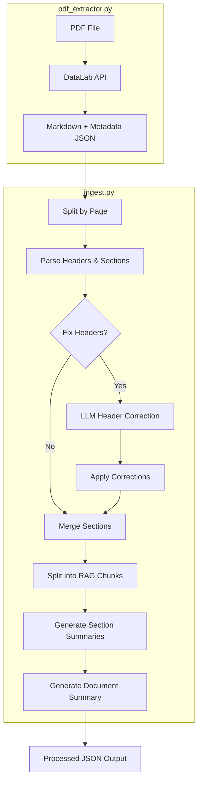

# Data Processing Module

A general-purpose pipeline for processing any PDF into RAG-ready chunks with hierarchical summaries. Extracts text, tables, and structure (headers/sections) — images and figures are excluded. Works with research papers, financial statements, regulatory documents, and more.

## Pipeline Flow



## Core Modules

### `pdf_extractor.py`

Extracts markdown from PDFs via [DataLab API](https://www.datalab.to).

- `extract_pdf_sync()` - Synchronous extraction with polling
- `extract_pdf_async()` - Async version using httpx
- Outputs JSON with markdown and page delimiters to `data/extracted/`

### `ingest.py` - Main Orchestrator

Streamlined orchestrator (~100 lines) that coordinates the entire pipeline:

```python
DocumentIngestor(fix_headers=True, chunk_size=1000, chunk_overlap=200)
  .ingest(markdown_text, filename) -> ProcessedDocument
```

**Pipeline Steps**:

1. Parse markdown → `parsing.split_by_page()`, `parsing.process_text_pages()`
2. Correct headers (optional) → `header_correction.correct_headers()`
3. Merge small chunks → `chunking.merge_chunks()`
4. Split large chunks → `chunking.split_chunks()`
5. Build header tree → `header_correction.build_header_tree()`

### `llm_client.py` - LLM Wrapper

Unified LLM interface with **OpenAI primary, Gemini fallback**:

- `chat_completion()` - Sync completion with auto-fallback
- `async_chat_completion()` - Async version
- Supports structured output (Pydantic models)
- Cost tracking for both providers

**Fallback Logic**: If OpenAI fails → automatically tries Gemini 2.0 Flash (FREE tier)

### `parsing.py` - Markdown Parsing

Extract sections, headers, and tables from markdown:

- `split_by_page()` - Split by page delimiters
- `parse_sections()` - Extract sections based on headers
- `extract_tables()` - Extract markdown tables with improved detection
- `process_text_pages()` - Main processing pipeline

### `chunking.py` - Chunk Operations

Merge and split text chunks for optimal RAG performance:

- `merge_chunks()` - Combine small chunks under same header
- `split_chunks()` - Split large chunks with overlap (preserves `chunk_index`)

**Key Logic**: Tables never merged/split, uses `RecursiveCharacterTextSplitter`

### `header_correction.py` - Header Hierarchy Fixing

LLM-based header level correction using section numbering:

- `correct_headers()` - Main correction logic with LLM
- `apply_corrections()` - Apply fixes using section numbering (1.0 → 1.1 → 1.1.1)
- `build_header_tree()` - Build hierarchical header tree

### `summarization.py` - LLM Summarization

Generate hierarchical summaries (Sprint 2 feature):

- `generate_section_summaries()` - Bottom-up async summarization
- `generate_section_summaries_sync()` - Sync wrapper
- `generate_document_summary()` - Overall document summary

#### Header Parsing

Headers are detected using markdown patterns (`# Header 1`, `## Header 2`, etc.). Each chunk maintains a `header_path` - a breadcrumb trail of parent headers for context.

#### Header Correction

PDF extraction sometimes misidentifies header levels (e.g., "1.0 Coverage" as H2 instead of H1). The correction process:

1. Extract unique headers from all chunks
2. Send to LLM with `header_correction.jinja2` prompt
3. LLM returns corrections with confidence levels
4. Apply corrections using **section numbering patterns** (1.0 → 1.1 → 1.1.1) to re-establish parent-child relationships

### `models.py`

**Output Models** (defined in `shared/schemas.py`):

- `Chunk` - Atomic RAG unit with content, location, header_path
- `ProcessedDocument` - Container with chunks, summaries, header_tree, costs
- `HeaderAnalysis` / `HeaderCorrection` - Pydantic models for LLM responses

### `prompts.py`

Template loader using Jinja2. We use Jinja2 templates for cleaner prompt management - separates prompt logic from Python code and makes prompts easier to iterate on.

## Templates

| Template                   | Purpose                                |
| -------------------------- | -------------------------------------- |
| `header_correction.jinja2` | Prompt for LLM to fix header hierarchy |
| `section_summary.jinja2`   | Prompt for section summarization       |
| `document_summary.jinja2`  | Prompt for overall document summary    |

## Scripts

### `scripts/run/run_pdf_extraction.py`

```bash
# Extract single PDF
uv run python scripts/run/run_pdf_extraction.py document.pdf

# Extract all PDFs in data/raw/
uv run python scripts/run/run_pdf_extraction.py
```

### `scripts/run/run_parsing.py`

```bash
# Parse single file (with summaries)
uv run python scripts/run/run_parsing.py "filename.json"

# Parse all files with header correction
uv run python scripts/run/run_parsing.py --fix-headers

# Skip summary generation
uv run python scripts/run/run_parsing.py --skip-summaries
```

## Data Directories

| Directory         | Contents                                              |
| ----------------- | ----------------------------------------------------- |
| `data/raw/`       | Input PDFs                                            |
| `data/extracted/` | JSON output from pdf_extractor (markdown + metadata)  |
| `data/processed/` | Final processed JSON (chunks, summaries, header_tree) |

> **Note:** PDF extraction could alternatively use [pymupdf4llm](https://github.com/pymupdf/pymupdf4llm) (open-source, free) which performs nearly as well but struggles with complex table extraction.
