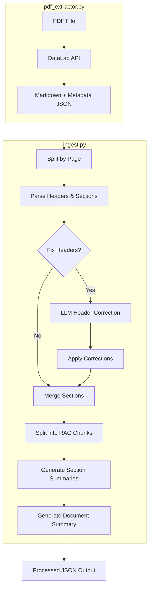

# Data Processing Module

A general-purpose pipeline for processing any PDF into RAG-ready chunks with hierarchical summaries. Extracts text, tables, and structure (headers/sections) — images and figures are excluded. Works with research papers, financial statements, regulatory documents, and more.

## Pipeline Flow



## Core Modules

### `pdf_extractor.py`
Extracts markdown from PDFs via [DataLab API](https://www.datalab.to).
- `extract_pdf_sync()` - Synchronous extraction with polling
- `extract_pdf_async()` - Async version using httpx
- Outputs JSON with markdown and page delimiters to `data/extracted/`

### `ingest.py`
Main ingestion class `DocumentIngestor` with the following pipeline:

| Step | Method | Description |
|------|--------|-------------|
| 1 | `_split_by_page()` | Splits markdown by page delimiters |
| 2 | `_process_text_pages()` | Extracts sections and builds header paths |
| 3 | `_correct_headers()` | LLM-based header level correction |
| 4 | `_merge_sections()` | Combines small chunks under same header |
| 5 | `_split_chunks()` | Splits large chunks for RAG (default 1000 chars) |
| 6 | `generate_skeleton_summaries()` | Bottom-up hierarchical summaries |
| 7 | `generate_document_summary()` | 2-8 sentence document overview |

#### Header Parsing
Headers are detected using markdown patterns (`# Header 1`, `## Header 2`, etc.). Each chunk maintains a `header_path` - a breadcrumb trail of parent headers for context.

#### Header Correction
PDF extraction sometimes misidentifies header levels (e.g., "1.0 Coverage" as H2 instead of H1). The correction process:
1. Extract unique headers from all chunks
2. Send to LLM with `header_correction.jinja2` prompt
3. LLM returns corrections with confidence levels
4. Apply corrections using **section numbering patterns** (1.0 → 1.1 → 1.1.1) to re-establish parent-child relationships

### `models.py`
Data structures:
- `ProcessedChunk` - Atomic RAG unit with content, location, header_path
- `IngestedDocument` - Container with chunks, summaries, header_tree, costs
- `HeaderAnalysis` / `HeaderCorrection` - Pydantic models for LLM responses

### `prompts.py`
Template loader using Jinja2. We use Jinja2 templates for cleaner prompt management - separates prompt logic from Python code and makes prompts easier to iterate on.

## Templates

| Template | Purpose |
|----------|---------|
| `header_correction.jinja2` | Prompt for LLM to fix header hierarchy |
| `section_summary.jinja2` | Prompt for section summarization |
| `document_summary.jinja2` | Prompt for overall document summary |

## Scripts

### `scripts/run/run_pdf_extraction.py`
```bash
# Extract single PDF
uv run python scripts/run/run_pdf_extraction.py document.pdf

# Extract all PDFs in data/raw/
uv run python scripts/run/run_pdf_extraction.py
```

### `scripts/run/run_parsing.py`
```bash
# Parse single file (with summaries)
uv run python scripts/run/run_parsing.py "filename.json"

# Parse all files with header correction
uv run python scripts/run/run_parsing.py --fix-headers

# Skip summary generation
uv run python scripts/run/run_parsing.py --skip-summaries
```

## Data Directories

| Directory | Contents |
|-----------|----------|
| `data/raw/` | Input PDFs |
| `data/extracted/` | JSON output from pdf_extractor (markdown + metadata) |
| `data/processed/` | Final processed JSON (chunks, summaries, header_tree) |

## Output Schema

```json
{
  "document_id": "uuid-string",
  "filename": "document.pdf",
  "document_summary": "2-8 sentence overview...",
  "section_summaries": {
    "Section Name": "Summary of section...",
    "Section > Subsection": "Summary of subsection..."
  },
  "header_tree": {
    "Top Level Header": {
      "Nested Header": {},
      "Another Nested": {}
    }
  },
  "costs": {
    "header_correction": 0.0,
    "skeleton_summaries": 0.25,
    "document_summary": 0.01,
    "total": 0.26
  },
  "chunks": [
    {
      "chunk_id": "chunk_001",
      "document_id": "uuid-string",
      "content": "Chunk text content...",
      "chunk_index": 1,
      "location": { "page_number": 1 },
      "header_path": [
        { "level": "Header 1", "name": "Section Name" },
        { "level": "Header 2", "name": "Subsection Name" }
      ],
      "metadata": {
        "is_table": false
      }
    },
    {
      "chunk_id": "chunk_042",
      "document_id": "uuid-string",
      "content": "| Type | Amount |...",
      "chunk_index": 42,
      "location": { "page_number": 15 },
      "header_path": [
        { "level": "Header 1", "name": "Fees" }
      ],
      "metadata": {
        "is_table": true,
        "table_id": "table_003",
        "table_title": ""
      }
    }
  ]
}
```

## Costs

Example costs for a 174-page document (`2026-pgp.pdf`):

| Step | Cost |
|------|------|
| PDF Extraction (DataLab API) | ~$0.53 |
| Skeleton Summaries | ~$0.25 |
| Document Summary | ~$0.01 |
| **Total** | **~$0.79** |

> **Note:** PDF extraction could alternatively use [pymupdf4llm](https://github.com/pymupdf/pymupdf4llm) (open-source, free) which performs nearly as well but struggles with complex table extraction.
